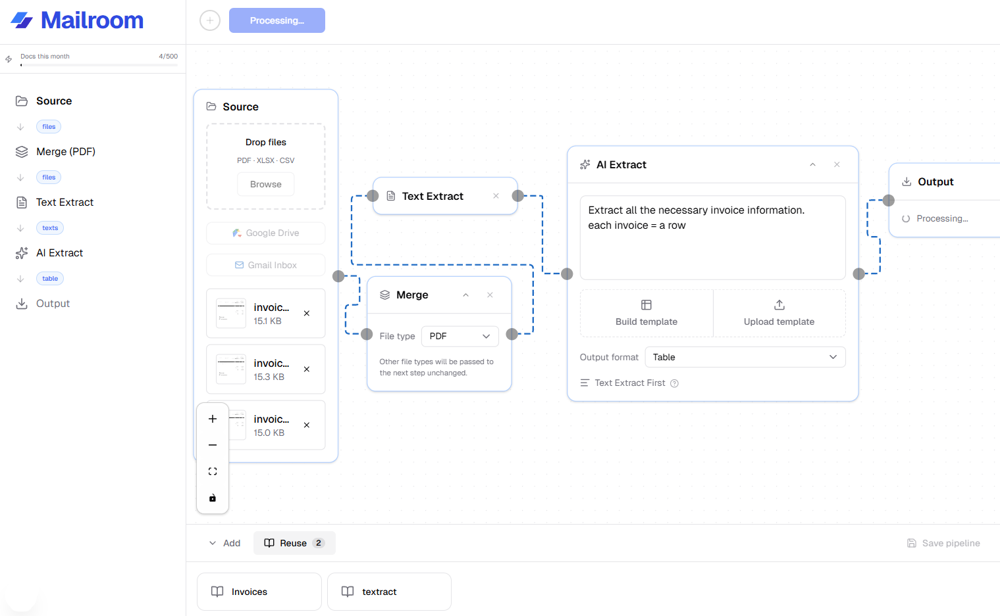

# Mailroom

**AI-powered document workflow automation. Create Customizable pipelines to streamline data extraction workflows end-to-end**

---

## The Problem

Document data entry is one of the most common and most painful manual workflows in business. Teams receive invoices, forms, and reports as PDFs or spreadsheets, then manually open each file, find the relevant fields, and copy them into a spreadsheet. It's repetitive, error-prone, and time-consuming and it hasn't been automated because existing tools (n8n, Zapier, OCR software) require significant technical setup and aren't built specifically for document extraction.

According to McKinsey, data entry and document processing account for a significant share of avoidable administrative time across finance, logistics, legal, and operations teams. Workers spend an estimated 1.8 hours per day on tasks that could be automated.

---

## The Solution

Mailroom replaces this workflow end-to-end. Users drop files into a pipeline (via email, computer, or drive), then create AI-powered pipeline steps, and get structured data out. Zero code required.

The full workflow:

1. **Source** — upload files directly, pull from a Google Drive folder, or capture from email
2. **Extract** — AI reads each document and pulls exactly the fields you specify, regardless of layout or format. You can create spreadsheet templates too.
3. **Validate** — flag and filter rows that fail your rules before they reach the spreadsheet
4. **Export** — download as XLSX/CSV or push directly to Google Sheets

Pipelines are saved and reusable. Drive and email listeners trigger pipelines automatically when new files arrive. The same pipeline that processes one invoice processes a thousand.

---

## Why someone would pay for this today

Manual document processing is already costing teams money. Mailroom delivers immediate, measurable time savings on a workflow every business has. It is priced at a one-time flat fee for beta ($1.99) with no subscription. Following the Beta, Companies can use a pay-as-you go model to process documents for pennis each, offering way better pricing than competitors with additional features.

---

## Demo

https://mailroom-two.vercel.app

---

## Sources

- McKinsey Global Institute — *The social and economic impact of artificial intelligence* (2023): estimate that 60%+ of jobs have at least 30% automatable activities, with data collection and processing as the primary category
- Zapier State of Business Automation (2022): 76% of workers say they spend 1–3 hours daily on repetitive tasks

---

## Stack

Next.js,
React,
Supabase,
Google APIs,
Shadcn
